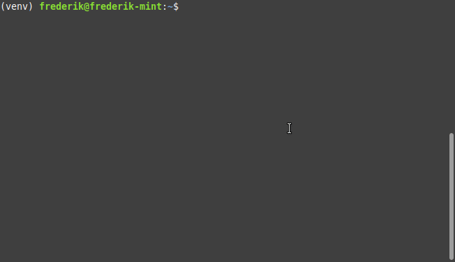

[](https://pypi.python.org/pypi/sshaws)
[](https://pypi.python.org/pypi/sshaws)
[](https://pypi.python.org/pypi/sshaws)
[](https://pypi.python.org/pypi/sshaws)

# sshaws

Simply connect to your 'EC2 Instance Connect'-capable AWS EC2 servers using one command.
If you use 'EC2 Instance Connect' as described [in this article](https://aws.amazon.com/blogs/compute/new-using-amazon-ec2-instance-connect-for-ssh-access-to-your-ec2-instances/) you already noticed that it can become a hassle to connect to instances, especially if you frequently connect to different instances. The `sshaws` command allows takes care of gathering the necessary information, calling ec2-instance-connect (to register your public key) and, finally, ssh to the instance.

With sshaws, in the best case, connecting to your instances will look like this:



## Requirements

- python3 and pip
- configured aws credentials and rights to connect to the instance
- instance needs to support ec2-instance-connect (AWS AMIs support that + you can install it on your servers)
- public (or private) IP needs to be reachable

## Installation

```bash
pip install sshaws
```

You might need to use pip3 if you are not in a virtualenv. You might want to install the package in user space (if you don't have sudo rights). E.g.:

```bash
pip3 install --user sshaws
```

## Usage

```bash
sshaws <instance-id>
```

`<instance-id>` should be replaced by something like: `i-074126021e7b3e7f5`. The Instance ID can be found in the AWS Console (EC2 view, ECS task description, etc.)

By default it will use the default region, your ssh key at ~/.ssh/id_rsa (private) and ~/.ssh/id_rsa.pub (public) and ec2-user as the username used to connect.
See the help output to see how to change these options:

```bash
sshaws --help
```

## More Examples

To look for the instance in two different regions use:

```bash
sshaws <instance-id> --regions eu-central-1 us-east-1
```

## Config

To avoid having to set command line arguments again and again you can write a config file to `~/.sshaws.conf`.

This is an example:

```json
{
    "os_user": "kevin",
    "use_private_id": true,
    "regions": ["eu-central-1", "us-east-1"],
    "key_file_path_private": "/home/example/.ssh/somekey",
    "key_file_path_public": "/home/example/.ssh/somekey.pub",
    "forward_agent": true
}
```

Private and public key might be combined in the same file in some cases. Just specify both options with the same value.
